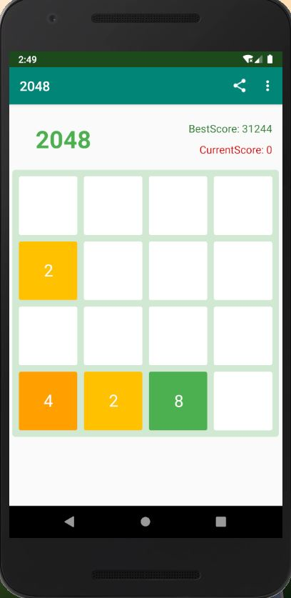

# 2048
Android练手，致谢：https://github.com/Panl/Love2048

# 2019——2020寒假练手项目2048

#### 该项目还有一个小bug， 实时得分无法获取，希望大佬们给出解决方案

# 效果图

| --主界面                                         | --关于                                           | --打赏                                           |
| ------------------------------------------------ | ------------------------------------------------ | ------------------------------------------------ |
|  |  |  |

# 如何才能完成2048**

> 尽量将最大的数字放在边角，相邻的位置的数字一次递减，构造等比数列，最终形成2048

